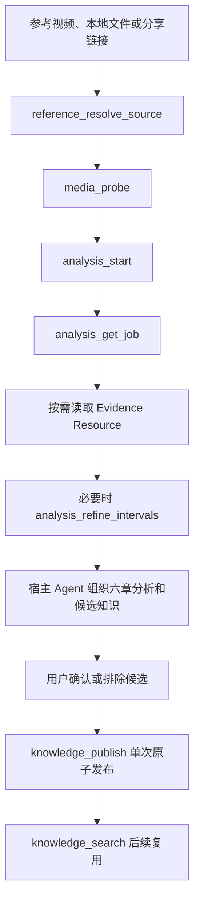
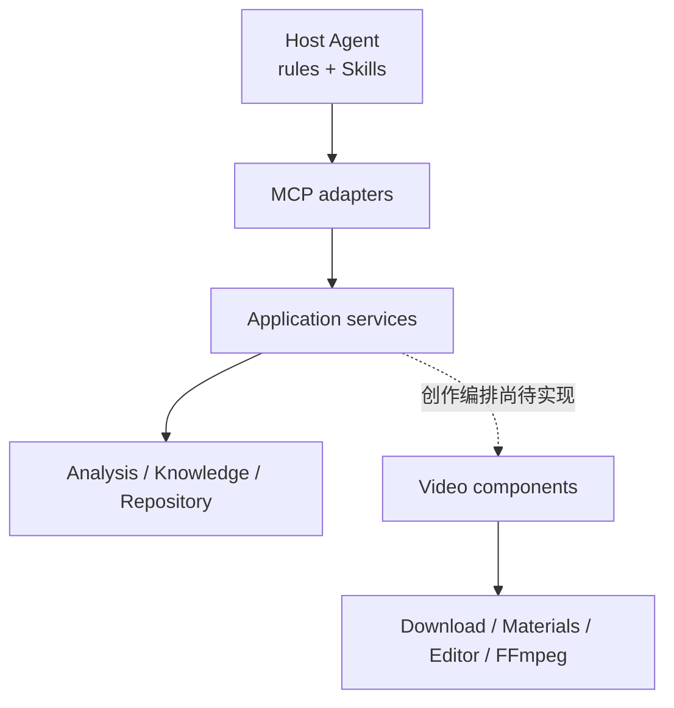

# video-create

面向 Codex、Claude Code、Cursor 等 Agent 的本地视频创作系统。项目把规则与 Skills、MCP
协议层、确定性分析能力以及下载、素材获取、剪辑和渲染组件放在同一仓库中。

> 当前边界：Plugin 已接通参考视频学习与知识沉淀主线；视频下载、素材获取和本地剪辑器可独立
> 使用。原创创作和参考驱动创作的 Plugin 级编排仍在实施，不能把已有组件等同于完整创作闭环。

## 当前状态

| 范围 | 状态 | 说明 |
| --- | --- | --- |
| Plugin 基础与 Context Catalog | 已实现 | 支持 MCP initialize、按需读取 rules、Skills 和 schemas |
| 参考媒体解析与取证 | 已实现 | 统一 SourceMedia、真实 PTS、视频帧、联系表、波形和音频事件候选 |
| 分析任务 | 已实现 | 持久化 queued/running/succeeded/failed 状态，支持恢复和区间细化 |
| 知识存储与检索 | 已实现 | EvidenceBundle 哈希闭包、LanceDB 原子发布、动态类型和离线中文语义检索 |
| Codex 真实参考学习闭环 | 待验收 | 仍需完成真实宿主六章分析、用户确认、单次知识发布和来源哈希检查 |
| 原创与参考驱动创作编排 | 待实现 | 尚未接通素材/BGM 准备、ActionSpec、能力预检、工程编译、渲染和成片审查 |
| 下载、素材获取、本地剪辑器 | 可独立使用 | 已提供 Python API、CLI；剪辑器另有 HTTP API、Web 工作台和 FFmpeg 导出 |

任务状态以 [`tasks/todo.md`](tasks/todo.md) 为准。当前实现完成 Task 1–12，Task 13 等待
真实宿主验收，Phase 2 和 Phase 3 尚未开始。

## 当前运行逻辑

### 参考视频学习



确定性组件只产出媒体事实和证据；画面语义、音画关系及可迁移剪辑语法由宿主 Agent 根据证据
判断。用户确认前不发布共享知识。

### 尚未接通的创作闭环

目标流程如下，目前仍属于路线图：

```text
用户创作需求
→ 创作方向
→ 图片/视频素材准备
→ BGM 准备
→ EditingSpecification 与 ActionSpec
→ Capability Registry 与 Preflight
→ EditorProject 与 SpecTraceMap 编译
→ 渲染执行
→ RenderInspection 与修复
→ 最终视频
```

## 系统结构



| 路径 | 职责 |
| --- | --- |
| `rules/` | 主 Agent 和参考学习角色边界 |
| `skills/` | 参考画面、BGM、音画关系和剪辑语法分析方法 |
| `video_create_plugin/mcp/` | MCP Server、Context Resources 与参考学习工具 |
| `video_create_plugin/analysis/` | SourceMedia、真实音画证据和 EvidenceBundle |
| `video_create_plugin/knowledge/` | LanceDB 存储、离线向量和语义检索 |
| `video_create_plugin/repository/` | 持久分析 Job |
| `components/video_analysis/` | 基于真实 PTS 的视频帧、切点和联系表证据 |
| `components/audio_analysis/` | 波形、能量、tempo 和 beat 候选证据 |
| `components/video_download/` | 链接或分享文本解析与视频下载 |
| `components/material_acquisition/` | 素材搜索、下载和来源溯源 |
| `components/video_editor/` | EditorProject、CLI、HTTP、Web 预览和 FFmpeg 渲染 |
| `schemas/` | 公共值对象和 Context Catalog Schema |
| `tasks/` | 分阶段实施计划与验收清单 |

依赖方向固定为：Host 内容 → MCP adapters → Application services → 领域服务与确定性组件。
组件不依赖 MCP、rules 或 Skills。

## 快速开始

### 环境要求

- Python 3.11 或更高版本
- [uv](https://docs.astral.sh/uv/)
- FFmpeg，并确保 `ffmpeg` 和 `ffprobe` 位于 `PATH`
- Playwright Chromium：解析需要浏览器的链接时使用
- Node.js：仅用于 Web JavaScript 语法验证

### 获取与安装

```powershell
git clone https://github.com/guigu856/video-create.git
Set-Location video-create
uv sync --extra dev
Copy-Item .env.example .env
```

按本机环境填写 `.env`。普通本地文件分析不需要素材平台 API Key。需要解析依赖浏览器的链接时，
先让 Playwright 的安装目录与 `.mcp.json` 中的 `PLAYWRIGHT_BROWSERS_PATH` 保持一致，再安装
Chromium：

```powershell
$env:PLAYWRIGHT_BROWSERS_PATH = 'D:\ai-cache\ms-playwright'
uv run playwright install chromium
```

## 使用方式

### 启动参考学习 MCP

```powershell
uv run video-create-mcp
```

默认持久数据根为 `~/.video-create/`。如需指定位置：

```powershell
$env:VIDEO_CREATE_WORKSPACE = 'D:\video-create-data'
uv run video-create-mcp
```

仓库已提供 `.mcp.json`、`.codex-plugin/plugin.json` 和 `.claude-plugin/plugin.json`。MCP 当前公开
8 个参考学习工具：

- `reference_resolve_source`
- `media_probe`
- `analysis_start`
- `analysis_get_job`
- `analysis_refine_intervals`
- `knowledge_list_stage_types`
- `knowledge_publish`
- `knowledge_search`

规则、Skills、Schema、分析证据和已发布知识通过 MCP Resources 按需读取。

### 启动本地视频剪辑器

```powershell
uv run video-editor serve --host 127.0.0.1 --port 8765
```

浏览器打开 `http://127.0.0.1:8765`。剪辑器使用统一的 `schema_version: "2.0"`
EditorProject，可通过 Python API、CLI、`/api/v1` HTTP API 或 Web 工作台操作。

常用 CLI：

```powershell
uv run video-editor project create --name "短片工程"
uv run video-editor project list
uv run video-editor asset import PROJECT_ID D:\media\source.mp4 --expected-revision REVISION
uv run video-editor command apply PROJECT_ID --file command-batch.json
uv run video-editor render PROJECT_ID --expected-revision REVISION --output D:\exports\final.mp4
```

当前稳定能力包括多轨视频、图片、音频与文本，静态 Transform、源区间裁剪、分割、多层覆盖、
静态音量、多路音频混合以及 H.264/AAC MP4 输出。

### 下载视频

```powershell
uv run video-download "<视频链接或平台分享文本>"
```

成功结果以单行 JSON 写入标准输出，默认文件位置为 `output/download/`。Cookie、代理和浏览器
CDP 配置见 [`.env.example`](.env.example)。

### 搜索并获取素材

```powershell
uv run material-acquisition sources
uv run material-acquisition search "city night" --limit 3
uv run material-acquisition acquire "<candidate_ref>"
```

下载文件位于 `output/materials/downloads/`，来源与授权记录位于
`output/materials/provenance/`。

## 配置

| 环境变量 | 用途 |
| --- | --- |
| `VIDEO_CREATE_WORKSPACE` | SourceMedia、Job、证据和 LanceDB 的持久数据根 |
| `PLAYWRIGHT_BROWSERS_PATH` | Playwright 浏览器缓存目录 |
| `VIDEO_DOWNLOADER_COOKIES_PATH` | yt-dlp 使用的 Netscape Cookie 文件 |
| `VIDEO_DOWNLOADER_PROXY` | 下载与浏览器访问使用的 HTTP(S) 代理 |
| `VIDEO_DOWNLOADER_BROWSER_CDP` | 复用已运行 Chrome 会话的 CDP 地址 |
| `PEXELS_API_KEY` | Pexels 素材源凭据 |
| `PIXABAY_API_KEY` | Pixabay 素材源凭据 |
| `VIDEO_EDITOR_ROOT` | 本地剪辑器工程目录 |
| `VIDEO_EDITOR_FONT_PATH` | FFmpeg 字幕字体路径 |

完整配置项见 [`.env.example`](.env.example)。

## 验证

```powershell
uv run pytest -q
uv run ruff check .
uv run mypy
Get-ChildItem components/video_editor/web/*.js |
  ForEach-Object { node --check $_.FullName }
```

当前参考学习相关聚焦测试、Ruff、mypy 和 Web JavaScript 语法检查通过。完整 `pytest`
仍存在已知基线问题：`tests/test_video_editor_effects.py` 导入
`components.video_editor.ClipFilter` 时失败。因此现阶段不应把仓库描述为完整测试全绿。

## 路线图

1. **Phase 1 收尾**：完成 Task 13 的真实 Codex 参考学习验收和 Checkpoint B。
2. **Phase 2 创作与执行**：实现三阶段创作合同、素材/BGM 准备、ActionSpec、能力预检、
   EditorProject 编译、渲染、成片审查，以及原创和参考驱动创作闭环。
3. **Phase 3 引擎扩展**：逐项闭合关键帧、转场、变速、遮罩、音频自动化、Composition
   和预览/导出一致性。

详细计划见 [`tasks/plan.md`](tasks/plan.md) 和 [`tasks/todo.md`](tasks/todo.md)。

## 文档

- [命令速查](docs/命令速查.md)
- [剪辑创作 Plugin 架构设计](docs/架构/剪辑创作插件架构设计.md)
- [参考学习任务设计](docs/架构/参考学习任务设计.md)
- [本地视频剪辑器](docs/组件/本地视频剪辑器.md)
- [视频下载组件](docs/组件/视频下载组件.md)
- [素材获取组件](docs/组件/素材获取组件.md)
- [知识存储与检索](docs/组件/知识存储与检索.md)
- [代码编写规范](docs/rule/代码编写规范.md)
- [文档编写规范](docs/rule/文档编写规范.md)
