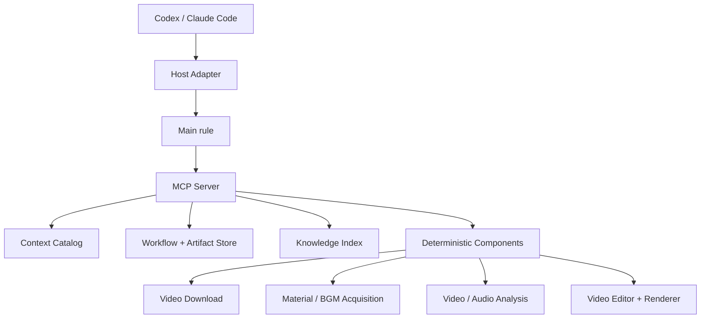

# 剪辑创作插件架构设计

> 状态：已确认
> 设计基线：`cbe62875b933ec455f719bbb5f125c2ac174a179`
> 本文定义 Plugin、MCP Server、rules、skills、视频分析、知识存储、分阶段创作与现有剪辑引擎的最终边界。

## 1. 系统目标

本项目交付一个本地剪辑创作 Plugin，使 Codex、Claude Code 等宿主 Agent 通过同一组阶段规则、思维技能和 MCP 工具完成三类任务：

1. 学习参考视频并沉淀可复用剪辑知识。
2. 从用户想法逐步生成视频并交给现有剪辑引擎执行。
3. 先分析参考视频，再使用新素材创作具有相似剪辑规律和观看体验的视频。

Plugin 由四类内容组成：

```text
Plugin
├── Host manifests          Codex / Claude Code 薄适配
├── rules                   角色职责、阶段权限与禁止项
├── skills                  各阶段的思维步骤与工具使用说明
└── MCP Server
    ├── 工作流与产物
    ├── 确定性视频/音频分析
    ├── 视频下载、素材与 BGM 获取
    ├── 知识存储与检索
    └── 工程校验、渲染与成片检查
```

系统采用以下职责分离：

- Agent 决定任务类型、阶段计划、语义判断和创作内容。
- rules 规定角色拥有哪些决策权以及何时停止。
- skills 规定完成某类判断时应观察哪些证据、按什么步骤思考、调用哪些工具。
- MCP Server 执行可校验操作并持久化状态，不在内部隐式进行创意决策。
- 现有组件继续拥有下载、素材获取和剪辑执行领域逻辑，MCP 只做薄映射。

## 2. 基线事实与新增范围

### 2.1 指定提交已有能力

| 模块 | 已有公共边界 | 可直接复用内容 |
| :-- | :-- | :-- |
| `components/video_download/` | `download_video(...) -> DownloadResult`、`video-download` CLI | 分享文本取链、抖音 Playwright、yt-dlp、ffprobe 验证、稳定错误码 |
| `components/material_acquisition/` | `sources -> search -> acquire` | 视频素材检索、`candidate_ref`、授权字段门禁、SHA-256、provenance JSON；公共服务当前只开放视频 |
| `components/video_editor/` | `EditorProject 2.0`、`CommandBatch`、`VideoEditorService`、CLI、HTTP | 工程 revision、素材导入、静态多轨合成、持久化渲染队列、FFmpeg 输出验证 |

基线证据：

- `pyproject.toml:5-39`
- `components/video_download/downloader.py:42-151`
- `components/material_acquisition/service.py:145-380`
- `components/video_editor/models.py:12-180`
- `components/video_editor/commands.py:70-173`
- `components/video_editor/render.py:47-314`
- `docs/架构/本地视频剪辑器架构.md:580-618`

### 2.2 指定提交缺少的能力

- Plugin manifests 与 MCP Server。
- 按任务和阶段组织的 rules、skills 与资源目录。
- 视频分析任务、抽帧、候选切点、密集复核和证据清单。
- BGM 多层结构、音画关系和剪辑句子分析。
- 分阶段任务、产物版本、用户确认记录和血缘关系。
- 图片素材获取公共接口，以及 BGM 搜索、下载、授权与溯源公共接口。
- 素材抽帧、转码、裁切、抠像等预处理的统一 provenance 契约。
- 权威产物库、向量知识索引和阶段过滤检索。
- 可执行剪辑规格到现有 `EditorProject` 的转换校验与可追溯映射。
- 渲染结果对规格的自动检查报告。

### 2.3 当前引擎能力边界

`EditorProject 2.0` 当前支持：

- 素材源区间裁切；
- 静态位置、尺寸、旋转与透明度；
- visual 轨多层覆盖；
- 固定样式文本；
- 静态音量与多路音频混合；
- H.264/AAC MP4 输出。

当前工程模型没有关键帧、缓动、变速、遮罩、转场对象、效果作用域、跨镜头延续、节拍引用和嵌套 Composition。规格转换遇到这些能力时必须返回 `CapabilityGap`，不得忽略字段、替换效果或简化创意。

## 3. 核心架构原则

### 3.1 单向具体化

```text
总体方案：确定做成什么以及采用什么制作方法
素材与 BGM：确定实际使用什么资源
剪辑规格：确定资源怎样形成精确时间线
执行工程：把已确认规格映射为 EditorProject
剪辑引擎：执行工程
成片检查：报告规格与结果之间的偏差
```

下游阶段只继续具体化上游产物。素材不足、能力缺口或渲染问题只形成报告，由用户指定返回阶段。

### 3.2 角色不是进程

角色表示一组稳定职责和输入输出合同，不等于强制启动子 Agent。

- 宿主支持且并行有价值时，主 Agent 可把当前 `StageEnvelope` 委派给子 Agent。
- 主 Agent 独立执行时，加载同一角色 rule 和 skills。
- 两种执行方式提交同一种 Artifact，接受同一套验证。

### 3.3 创意内容与程序数据分层

| 内容 | 表达方式 |
| :-- | :-- |
| 视频总体方案 | 固定语义板块的自然语言文档 |
| 参考片总体理解 | 自然语言报告，结论携带证据与置信度 |
| 素材包、来源、授权、BGM 分析 | 严格 JSON |
| 逐镜可执行剪辑规格 | 人类可读表格与严格 ActionSpec 附录；自然语言说明创作意图，稳定 ID 承担程序校验 |
| 执行工程、渲染参数、任务状态 | 严格 Schema |
| 向量知识单元 | 结构化元数据加语义正文 |

严格 Schema 不提前代替创意表达；所有程序边界仍使用稳定模型、版本和错误码。

### 3.4 用户确认是唯一冻结触发源

Agent 先在对话中展示阶段产物。用户明确确认后，主 Agent 才提交冻结请求；冻结请求必须携带 Artifact ID、revision、SHA-256 与 `expected_stage_revision`。

确认来源分为两级：

- `host_verified`：宿主在模型调用链之外生成 `HostApprovalReceipt`，回执绑定 Artifact 哈希、用户动作、宿主消息 ID、nonce 与时间。
- `audit_only`：首期宿主只有会话消息引用时，服务器记录引用和请求参数，作为流程审计记录；该等级不宣称具备独立身份校验。

MCP Server 在同一事务内创建 FreezeRecord、更新 Artifact/StageRun 状态并固化依赖闭包。它不推断用户意图，也不自行发起确认。已冻结 Artifact 保持不可变；内容变化会创建新 revision。支持宿主回执后，工作流策略可要求指定阶段仅接受 `host_verified`。

## 4. Plugin 包结构

```text
video_create/
├── .codex-plugin/
│   └── plugin.json
├── .claude-plugin/
│   └── plugin.json
├── .mcp.json
├── rules/
│   ├── main-agent.md
│   ├── common/
│   │   ├── evidence-boundary.md
│   │   └── stage-boundary.md
│   ├── reference-study/
│   └── creation/
├── skills/
│   ├── reference-study/
│   ├── reference-visual-analysis/
│   ├── reference-bgm-analysis/
│   ├── audiovisual-relation-analysis/
│   ├── editing-grammar-synthesis/
│   ├── creative-direction/
│   ├── material-preparation/
│   ├── bgm-preparation/
│   ├── editing-specification/
│   ├── execution-project-authoring/
│   └── render-inspection/
├── video_create_plugin/
│   ├── mcp/
│   ├── context/
│   ├── workflow/
│   ├── artifacts/
│   ├── knowledge/
│   └── application/
├── components/
│   ├── video_download/             现有
│   ├── material_acquisition/       现有
│   ├── video_editor/               现有
│   ├── video_analysis/             新增
│   ├── audio_analysis/             新增
│   ├── bgm_acquisition/            新增
│   ├── image_acquisition/          新增
│   ├── media_preprocessing/        新增
│   ├── report_generation/          新增
│   └── render_inspection/          新增
└── tests/
```

两个宿主 manifest 只声明名称、触发说明、skills 目录和 MCP 配置。rules、skills、组件与业务状态只有一份，不为每种宿主复制实现。

项目根目录 `.mcp.json` 启动本地 stdio Server：

```json
{
  "mcpServers": {
    "video-create": {
      "command": "uv",
      "args": ["run", "video-create-mcp"],
      "cwd": "."
    }
  }
}
```

首期运行拓扑为 Windows 本地、单用户、同一任务单活宿主、stdio MCP。工作流数据持久化，宿主切换时从任务状态继续执行。

## 5. 运行拓扑与依赖方向



依赖方向固定为：

```text
Host manifests / skills / rules
        ↓
MCP handlers
        ↓
Application services
        ↓
Workflow / Artifact / Knowledge repositories + independent components
```

- MCP Handler 只解析参数、调用应用服务、映射结果和错误。
- 应用服务组合既有组件的 Python 公共 API，不通过 shell 回调项目自身 CLI。
- 组件不依赖 MCP、宿主、rules 或 skills。
- `VideoEditorService` 继续保持与 FastAPI、MCP 和 FFmpeg 进程编排解耦。

## 6. rules、skills 与渐进式上下文

### 6.1 三类内容的职责

| 类型 | 内容 | 加载时机 |
| :-- | :-- | :-- |
| main rule | 任务分类、阶段路由、用户确认、修改归属、禁止越权 | Plugin 触发后首先加载 |
| role rule | 当前角色的输入、决策权、禁止项、输出和停止条件 | 进入对应阶段时加载 |
| skill | 证据检查顺序、推理步骤、工具调用和产物模板 | 当前阶段确实需要该能力时加载 |

rule 不包含完整操作教程；skill 不重新定义角色权限；MCP Tool 不携带隐藏角色提示词。
任务类型判断直接属于 main rule，不建立只重复分类条件的 router skill。

### 6.2 MCP 中的呈现方式

MCP 官方协议把 Resources 用于上下文，把 Tools 用于模型主动执行的操作。因此 rules、skills、Artifact 与 Evidence 通过 MCP Resources 暴露，执行动作通过 MCP Tools 暴露。规范依据见 [MCP Server Primitives](https://modelcontextprotocol.io/specification/2025-06-18/server/index)。

资源 URI：

```text
video-create://catalog
video-create://rules/main-agent
video-create://rules/{role_id}
video-create://skills/{skill_id}
video-create://tasks/{task_id}/stage-envelope
video-create://stage-access/{handle}/artifacts/{artifact_id}
video-create://stage-access/{handle}/evidence/{analysis_id}/{evidence_id}
video-create://schemas/{schema_name}
```

Context Catalog 只注册固定的 rule/skill 资源；任意文件路径不进入加载接口，避免路径越界和上下文版本漂移。
Catalog 启动时校验全部固定内容：rule 必须以一级标题开始，skill 必须包含名称和说明
frontmatter，schema 必须是 JSON object。任一内容缺失、编码错误或结构不合法时，Server
拒绝启动并返回稳定错误；目录中的 `content_sha256` 按分发文件的 UTF-8 字节计算。

Resource 内容本身不获得 system-rule 优先级。Host Adapter 负责在创建阶段 Agent 或进入新阶段前读取 StageEnvelope、rule 与 skill Resources，并按宿主支持的上下文层级注入；MCP Server 只分发版本化内容，不负责激活角色。单 Agent 模式下旧阶段文本可能仍保留在会话中，渐进式加载只约束新增上下文，服务器侧阶段权限仍由 access handle 强制检查。

### 6.3 StageEnvelope

主 Agent 判定任务类型并创建任务后，Host Adapter 在每次进入阶段时调用 `workflow_get_stage_envelope`，读取返回的资源 URI，并把当前阶段上下文交给执行该阶段的 Agent：

```json
{
  "task_id": "task_xxx",
  "task_type": "reference_guided_creation",
  "task_revision": 4,
  "stage_run_id": "stage_xxx",
  "stage": "editing_specification",
  "stage_revision": 2,
  "stage_access_handle": "opaque_server_handle",
  "expires_at": "2026-07-22T12:00:00Z",
  "role_resource": "video-create://rules/creation/editing-spec-agent",
  "skill_resources": [
    "video-create://skills/editing-specification"
  ],
  "allowed_resources": [
    "video-create://stage-access/opaque_server_handle/artifacts/artifact_plan",
    "video-create://stage-access/opaque_server_handle/artifacts/artifact_assets",
    "video-create://stage-access/opaque_server_handle/artifacts/artifact_bgm"
  ],
  "allowed_tools": [
    "knowledge_search",
    "workflow_submit_artifact"
  ],
  "input_artifacts": [
    {"artifact_id": "artifact_plan", "revision": 2, "sha256": "...", "freeze_ref": "freeze_plan"},
    {"artifact_id": "artifact_assets", "revision": 1, "sha256": "...", "freeze_ref": "freeze_assets"},
    {"artifact_id": "artifact_bgm", "revision": 1, "sha256": "...", "freeze_ref": "freeze_bgm"}
  ],
  "retrieval_scope": {
    "stage": "stage3",
    "task_private_analysis_ids": ["analysis_xxx"]
  },
  "output_contract": "video-create://schemas/editing-specification",
  "confirmation_required": true
}
```

`stage_access_handle` 是服务器生成、短期有效且与 TaskRun、StageRun、revision、lease、allowed tools 和输入冻结闭包绑定的随机句柄。所有阶段写工具及受阶段约束的读取工具都必须携带该句柄；服务器拒绝过期、revision 冲突、stale 或越权调用。

所有 MCP Tools 仍处于固定可发现目录中。渐进式暴露指 Host Adapter 按阶段加载 rules、skills、输入 Artifact 和检索范围；Server 通过 access handle 执行最终权限检查。

## 7. Agent 角色结构

| 角色 | 决策权 | 输出 |
| :-- | :-- | :-- |
| 主 Agent | 任务类型、阶段计划、是否委派、确认点、修改路由 | TaskRun 与阶段调用 |
| 参考源处理角色 | 选择分析参数与证据细化区间 | ReferenceManifest、EvidenceBundle |
| 画面分析角色 | 主镜头、可见图层、运动、效果作用域、镜头组 | VisualAnalysis |
| BGM 分析角色 | 音乐段落、节奏层、声音事件、能量结构 | BgmAnalysis |
| 音画关系角色 | 同步、提前蓄力、拍后释放、延音维持和非节拍关系 | AudiovisualMap |
| 剪辑规律角色 | 连续镜头组成的剪辑句子与可迁移机制 | ReusableEditingGrammar |
| 总体方案角色 | 视频类型、核心机制、制作方法与观看体验 | CreativeDirection 文档 |
| 素材角色 | 资源发现、筛选、预处理与溯源 | MaterialPackage |
| BGM 筹备角色 | BGM 选择与音乐分析 | BgmPackage |
| 镜头规划角色 | 已确认资源范围内的具体时间线设计 | EditingSpecification |
| 执行工程角色 | 发起能力预检和确定性编译，不新增创意 | CapabilityAssessment 或 EditorProject + SpecTraceMap |
| 成片检查角色 | 解释确定性检查结果并向用户报告 | RenderInspectionReport |

任何角色都不得改写已经批准的上游 Artifact。

## 8. 三类任务流程

### 8.1 学习参考视频 `reference_study`


多维分析包含：

- 视频总体机制；
- 主镜头边界与镜内状态变化；
- 图层、PIP、遮罩、动画和效果作用域；
- BGM 段落、节奏层、能量和声音事件；
- 画面变化与音乐事件的时序关系；
- 连续镜头组成的剪辑句子；
- 观看体验和可迁移剪辑规律。

只有汇总报告需要用户确认。各分析维度是同一阶段内的工作单元，可按需串行或并行。

### 8.2 原创视频 `original_creation`

```text
用户想法
→ 视频总体方案
→ 用户确认并冻结
→ 素材与 BGM 筹备
→ 用户确认并冻结
→ 逐镜可执行剪辑规格 + ActionSpec
→ 用户确认并冻结
→ Capability Preflight
→ 能力齐备后确定性编译 EditorProject + SpecTraceMap
→ 工程与覆盖校验
→ 剪辑引擎执行
→ 成片检查
```

`original_creation` 虽然没有绑定本次参考视频分析，但创作阶段一至三均可检索共享 `creation_knowledge`：

| 阶段 | 强制检索范围 | 用途 |
| :-- | :-- | :-- |
| 阶段一：总体方案 | `applicable_stages=stage1` + 对应 `knowledge_type` | 借鉴视频类型、核心机制、视觉语言、节奏方法和观看体验 |
| 阶段二：素材与 BGM | `applicable_stages=stage2` + 对应 `knowledge_type` | 借鉴素材特征、动作方向、预处理方式、BGM 气质与能量结构 |
| 阶段三：剪辑规格 | `applicable_stages=stage3` + 对应 `knowledge_type` | 借鉴剪辑句子、图层模式、音画关系、镜头密度与转场规律 |

每个阶段先读取当前任务已经冻结的上游 Artifact，再检索 `status=active`、`visibility=creation_shared`、`transferability=reusable_mechanism` 的共享知识。阶段四的能力预检、工程编译、渲染和成片检查只读取冻结 Artifact、Schema 与 Capability Registry，其 StageEnvelope 不包含 `knowledge_search`，避免执行阶段引入新的创意判断。

### 8.3 参考驱动创作 `reference_guided_creation`

```text
ReferenceStudyFlow
→ 确认后的本次参考分析
→ OriginalCreationFlow
```

创作阶段的上下文顺序固定为：

1. 直接读取本任务绑定的确认版参考分析 Artifact。
2. 读取该分析面向当前阶段的 `creation_context_projection`。
3. 检索共享知识索引中的其他已确认案例。

本次参考分析不绕行共享向量召回，避免被历史相似案例稀释。

## 9. 视频分析组件

### 9.1 组件边界

`components/video_analysis/` 负责生成可复现证据，不负责最终语义判断：

- 计算源文件 SHA-256；
- 调用 ffprobe 获取音视频流和真实 time base；
- 建立 PTS 与 frame index；
- 生成代理文件、缩略图、联系表和指定时间帧；
- 计算相邻帧差、亮度、色彩变化、黑场、闪白和运动信号；
- 生成候选主镜头边界；
- 对指定区间按原始帧率或目标最大采样间隔重新取证；
- 输出 EvidenceManifest 与算法版本。

`components/audio_analysis/` 负责：

- 抽取 PCM 音轨与波形；
- 响度、静音、频谱、瞬态和 tempo 候选；
- beat grid、重拍候选、节奏密度和能量曲线；
- 音乐段落边界候选；
- 供 Agent 复核的音频片段和可视化证据。

鼓、贝斯、旋律、人声、SFX 的语义归属由 BGM 分析角色结合证据判断；算法输出须标明候选类型与置信度。

### 9.2 自适应多遍分析

```text
Pass 1  技术探测与低频全片扫描
Pass 2  视觉/音频变化候选检测
Pass 3  快切、复杂叠层和关键边界密集取证
Pass 4  Agent 逐镜与镜头组复核
Pass 5  时间线、证据引用和报告一致性检查
```

- 抽帧参数使用 `max_sample_interval` 表达，不把可变帧率视频映射成虚构固定帧号。
- 快切区间的最大取样间隔不大于 0.1 秒。
- 候选边界使用前后帧或原始帧率复核，最终时间使用真实 PTS。
- 画中画出现、字幕替换、局部特效和速度变化默认是镜内事件；主画面真实更换才建立新镜头。
- 自动差异峰值只是复核候选，不直接成为主镜头边界。

所有时序证据使用统一 `TimestampRef`：保留原始 `pts`、`time_base`、可用时的 `frame_index`、整数 `timestamp_us`，音频事件另保留 `sample_index` 与采样率。报告显示秒值，但程序关联和边界校验使用整数时间与原始时基。

### 9.3 EvidenceBundle

```text
analysis/{analysis_id}/
├── reference_manifest.json
├── evidence_manifest.json
├── media_probe.json
├── frame_index.jsonl
├── visual_signals.json
├── audio_signals.json
├── boundary_candidates.json
├── frames/
├── contact_sheets/
├── audio_clips/
└── visualizations/
```

`evidence_manifest.json` 记录每个文件的类型、时间范围、生成参数、算法版本和 SHA-256。Agent 报告中的结论必须引用 `evidence_id`。

### 9.4 结论证据等级

```text
measured                 工具直接测量
algorithm_candidate      算法提出、尚待语义复核
agent_inference          Agent 基于证据作出的解释
reconstruction_suggestion 缺少原工程时给出的重建方法
```

原始素材入点、原工程图层、关键帧曲线、独立 SFX 轨和具体插件参数不得标记为 `measured`。

## 10. 参考视频分析产物

### 10.1 `video_overview.md`

采用七个稳定板块：

1. 视频类型与核心机制。
2. 整体制作方法。
3. 视觉语言与画面组织。
4. 节奏与声音使用方法。
5. 转场与镜头连接原则。
6. 素材与音乐的性质。
7. 预期观看体验。

每个重要结论附 `fact_status`、`confidence` 和 `evidence_refs`。

### 10.2 `bgm_analysis.json` 与 `bgm_analysis.md`

至少包含：

- `audio_scope`：参考片只有压平后的混合音轨时标记为 `mixed_program_audio`；仅在取得独立音乐资产时标记为 `isolated_bgm`；
- 引入、蓄力、推进、高潮、缓冲和收尾段落；
- tempo 候选、拍号、基础拍、重拍、弱拍、切分音和密集节拍组；
- 鼓、贝斯、旋律、人声和音效等声音层事件；
- 能量上升、下降、停顿、释放、新音色和结构转折；
- 视频实际跟随的音乐层；
- 精确卡点、提前蓄力、拍后释放、延音维持和非节拍绑定；
- 时间范围、证据引用和置信度。

### 10.3 `reference_shot_analysis.json` 与表格文档

参考学习产物命名为“参考片逐镜分析表”，不命名为“新视频可执行剪辑规格表”。

| 镜头/节奏单元 | 原片绝对时间 | 主画面与可见图层 | 画面变化与空间关系 | 动画/效果作用域 | 声音事件与时序关系 | 与前后镜头连接 | 在剪辑句子中的功能 | 证据/置信度 |
| :-- | :-- | :-- | :-- | :-- | :-- | :-- | :-- | :-- |

`rhythm_unit_id` 把连续镜头组合为可检索剪辑句子，例如：

```text
蓄力镜头 → 连续快切 → PIP 叠加 → 重拍爆发 → 短暂停留
```

### 10.4 `reusable_editing_grammar.md`

包含：

- 核心观看体验；
- BGM 多层结构的使用规律；
- 镜头密度与音乐能量关系；
- 主画面、PIP、缩放、位移、遮挡和叠层的组合规律；
- 提前进入、延迟退出和跨镜头延续；
- 快切与缓冲交替形成的呼吸结构；
- 可迁移剪辑句子；
- 原片专属、只作证据的内容；
- 使用新素材重建相似节奏密度、视觉冲击力和观看体验的方法。

### 10.5 `creation_context_projection.json`

汇总分析提交确认前同时生成三个阶段投影，并由 `reference_report_manifest.json` 纳入同一依赖闭包：

- `stage1_knowledge`：类型、核心机制、制作方法、视觉语言、节奏与观看体验。
- `stage2_knowledge`：素材特征、动作方向、预处理需要、BGM 气质、段落和能量。
- `stage3_knowledge`：剪辑句子、镜头密度、PIP/图层、运动、效果作用域、音画绑定和转场模式。

投影不复制原片具体素材，不把原片时间点作为新视频时间线建议。

### 10.6 `reference_report_manifest.json`

该文件是参考学习阶段的 `primary_output_artifact_ref`，固定列出总体报告、BGM 分析、逐镜分析、剪辑规律、阶段投影和 EvidenceBundle 的 Artifact ID、revision 与哈希。报告工具先从已校验的分析 Artifact 生成草稿报告和清单，用户查看后再冻结主汇总 Artifact；其依赖闭包覆盖全部维度产物。

## 11. 创作阶段产物

### 11.1 阶段一：CreativeDirection

使用自然语言输出：

- 视频类型与核心机制；
- 整体制作方法；
- 视觉语言与画面组织；
- 节奏与声音方法；
- 转场与镜头连接原则；
- 素材与音乐性质；
- 预期观看体验。

本阶段排除具体素材、秒点、镜头数量、源入出点、坐标、关键帧和引擎参数。

### 11.2 阶段二：MaterialPackage 与 BgmPackage

`MaterialPackage` 包含已选素材、内容摘要、技术参数、可用区间、预处理结果、来源和授权证据。完整形态的素材入口包括用户提供文件、现有视频素材服务、新增图片素材服务，以及从已取得媒体生成的帧和预处理派生物；每类产物沿用 SHA-256 与 provenance 契约。现有 `materials_search` 只代表视频素材搜索。

`BgmPackage` 包含最终音乐文件、来源和授权、段落、节拍、能量、编辑提示及音频分析数据。

素材角色和 BGM 角色可并行，均不设计最终时间线。两者完成后生成 `PreparationPackageManifest` 作为本阶段主汇总 Artifact，其 parent refs 固定指向 MaterialPackage、BgmPackage 和全部 provenance Artifact。

### 11.3 阶段三：EditingSpecification

阶段三同时提交人类可读表格与权威机器附录 `editing_specification.json`。

| 镜头 | 绝对时间 | 使用素材 | 镜头规划编排 | 附加效果 | 声音与节拍 | 与下一镜头的转场 |
| :-- | :-- | :-- | :-- | :-- | :-- | :-- |

“镜头规划编排”必须说明每个素材的使用区间、位置、尺寸、层级、遮挡、进入/保持/退出、动画、效果、叠加关系和最终共同形成的画面。表格中的每项执行动作都引用稳定 `action_id`。

```text
shot_id
action_id
action_type
time_range = start_us + end_us
asset_refs[]
parameters
effect_scope
required_capabilities[]
human_description
audio_event_refs[]
transition_target_shot_id
```

严格 ActionSpec 负责动作枚举、参数与程序覆盖校验；自然语言保留创作意图和组合关系。表格与机器附录由同一 ArtifactEnvelope 管理，校验器检查 shot/action 双向引用完整性。

### 11.4 能力预检、确定性编译与可追溯映射

阶段四按固定顺序执行：

```text
EditingSpecification
→ Schema、素材引用与时间线校验
→ Capability Preflight
→ 存在缺口：输出 CapabilityGapReport 并停止
→ 能力齐备：确定性编译 EditorProject + SpecTraceMap
→ 工程领域校验
→ 提交渲染
```

`CapabilityAssessment` 逐项匹配 ActionSpec 的 `required_capabilities` 与引擎 Capability Registry。缺口动作只进入 `CapabilityGapReport`，不伪造工程 JSON 路径。

阶段四不解析自由文本，也不新增剪法。`editor_compile_spec` 只消费稳定 shot/action ID，并输出：

- `EditorProject`：符合现有剪辑引擎 Schema 的工程文件。
- `SpecTraceMap`：每个已支持 `action_id` 对应的工程 JSON 路径。
- `CapabilityAssessment`：本次预检结果及 Registry 版本。

确定性校验必须满足：

- 所有素材引用存在且哈希一致；
- 主镜头时间线完整，镜内动作时间和作用域合法；
- 所有 ActionSpec 都完成预检；
- 能力齐备时，每个 `action_id` 都有 TraceMap；
- 工程通过 Pydantic 与领域校验；
- 编译输入哈希、引擎 Schema 版本和 Capability Registry 版本写入产物。

## 12. 工作流与 Artifact 模型

### 12.1 TaskRun

```text
task_id
task_type = reference_study | original_creation | reference_guided_creation
status = active | awaiting_user | completed
current_stage
revision
reference_analysis_ids[]
created_at / updated_at
```

### 12.2 StageRun

```text
stage_run_id
task_id
stage_type
status = not_started | running | awaiting_confirmation | approved | stale
input_artifact_refs[]
input_freeze_refs[]
output_artifact_refs[]
primary_output_artifact_ref
revision
```

参考分析的各维度结果和阶段二的素材/BGM 结果可并行形成多个 Artifact。需要确认的对象是 `primary_output_artifact_ref` 指向的汇总 Artifact；其 `parent_artifact_refs[]` 必须覆盖该阶段的完整输出闭包。

### 12.3 ArtifactEnvelope

```text
artifact_id
artifact_type
task_id
stage_run_id
revision
status = draft | submitted | approved | superseded
content_uri
content_sha256
schema_version
producer_kind = agent | component
producer_id
rule_version?
skill_versions[]
model_id?
component_version?
parent_artifact_refs[]
evidence_refs[]
created_at
```

Artifact 的 `approved` 状态与 FreezeRecord 在同一数据库事务中产生；FreezeRecord 是批准事实的权威记录，读取 `approved` Artifact 时必须联查有效 FreezeRecord。

### 12.4 FreezeRecord

```text
freeze_id
task_id
stage_run_id
artifact_id
artifact_revision
artifact_sha256
input_freeze_refs[]
dependency_closure_sha256
user_confirmation_ref
confirmation_assurance = audit_only | host_verified
host_approval_receipt?
expected_stage_revision
frozen_at
```

`dependency_closure_sha256` 对主汇总 Artifact、全部 parent Artifact 和有效上游 FreezeRecord 的有序清单计算哈希。StageEnvelope 只装入具有有效 FreezeRecord 且依赖闭包一致的上游版本。

上游阶段重新打开时：

1. 创建上游新 revision。
2. 既有批准版保留用于审计。
3. 引用旧版的下游 StageRun 标记为 `stale`，其 access handle 立即失效。
4. `stale` 阶段禁止 submit、approve、publish、compile 与 render。
5. 等待用户指定重新执行的阶段，不自动改写或删除下游产物。

## 13. 知识存储与检索

### 13.1 三层存储

```text
SQLite
  TaskRun、StageRun、ArtifactEnvelope、FreezeRecord、KnowledgePublication、Job、catalog

文件对象库
  JSON、Markdown、DOCX、视频、音频、帧、联系表、波形和报告

LanceDB 本地索引
  creation_knowledge   已批准阶段投影中的可迁移机制
  reference_evidence  参考片专属语义证据，可选且与创作召回隔离
```

LanceDB 作为本地嵌入式索引，不是报告和时间线的权威来源。其本地运行与向量检索能力见 [LanceDB Quickstart](https://docs.lancedb.com/quickstart)。

### 13.2 知识分类

| 目标阶段 | knowledge_type |
| :-- | :-- |
| 阶段一 | `video_type`、`core_mechanism`、`production_method`、`visual_language`、`rhythm_method`、`transition_principle`、`asset_music_traits`、`viewing_experience` |
| 阶段二 | `asset_selection_traits`、`shot_composition_traits`、`action_direction_traits`、`preprocess_need`、`bgm_mood`、`music_sections`、`energy_curve`、`rhythm_events` |
| 阶段三 | `editing_sentence`、`shot_switch_logic`、`pip_layer_pattern`、`motion_pattern`、`effect_scope`、`audio_visual_binding`、`cross_shot_continuity`、`density_pattern`、`transition_pattern` |

### 13.3 KnowledgeUnit

```text
knowledge_id
publication_id
source_artifact_id
source_artifact_sha256
analysis_version
applicable_stages[]
knowledge_type
video_type_tags[]
technique_tags[]
music_layer_tags[]
energy_phase
granularity = global | section | rhythm_unit | shot
visibility = creation_shared | task_private | evidence_only
source_time_range
content
evidence_refs[]
fact_status
confidence
transferability = reusable_mechanism | reference_specific | uncertain
chunker_version
embedding_model_id
embedding_dimension
```

知识索引元数据固定记录分块器、嵌入模型和向量维度。任一项变化时创建新索引版本并重新构建，不在同一索引中混合向量空间；具体嵌入模型在实现期通过中文视频领域检索基准选定并锁定。

### 13.4 KnowledgePublication

```text
publication_id
source_artifact_id
source_artifact_sha256
source_media_sha256
publication_revision
status = active | superseded | withdrawn
supersedes_publication_id?
freeze_id
created_at
```

同一分析的新确认 revision 发布时，在一个事务中创建新 active publication，并把被替代版本标记为 `superseded`。历史记录继续可审计；默认检索只读取 active publication。撤回需要显式操作并保留记录。

### 13.5 发布门禁与集合隔离

`knowledge_publish` 只接受：

- 具有有效 FreezeRecord 的参考报告主 Artifact；
- 已生成并通过结构检查的 `creation_context_projection`；
- 每条知识单元都具有来源、证据和适用阶段；
- 面向创作共享的单元满足 `visibility=creation_shared` 且 `transferability=reusable_mechanism`。

`creation_knowledge` 只接收阶段投影中的可迁移机制。逐帧时间、具体人物、原素材和原片专属效果保留在权威 Artifact；如需语义检索，则进入独立 `reference_evidence` collection 并标记 `evidence_only`。`source_time_range` 只作为证据定位，不作为新视频时间线建议。

### 13.6 检索顺序

```text
当前任务绑定 Artifact 直接读取
→ active publication + stage + knowledge_type 硬过滤
→ visibility 与 transferability 强制过滤
→ 视频类型、音乐层、能量阶段和技术标签过滤
→ 语义向量检索
→ 返回知识正文、证据引用和相邻节奏单元
```

创作检索强制 `visibility=creation_shared` 与 `transferability=reusable_mechanism`，调用方省略条件时由服务端补全而非放宽。向量结果不得替代绝对时间、beat grid、哈希、完整表格或冻结版本读取。

## 14. MCP Resources 与 Tools

### 14.1 Resources

| Resource | 用途 |
| :-- | :-- |
| `catalog` | 注册角色、skills、Schema、工具权限和版本 |
| `rules/*` | 角色职责与阶段边界 |
| `skills/*` | 当前阶段思维流程 |
| `tasks/*/stage-envelope` | 当前任务可见上下文 |
| `stage-access/*/artifacts/*` | 使用 access handle 精确读取阶段产物 |
| `stage-access/*/evidence/*` | 使用 access handle 读取帧、波形、联系表和结构化证据 |
| `schemas/*` | 查看输出合同 |

### 14.2 Workflow Tools

| Tool | 作用 |
| :-- | :-- |
| `workflow_create_task` | 持久化主 Agent 已判定的任务类型 |
| `workflow_get_task` | 读取任务、阶段和 revision |
| `workflow_get_stage_envelope` | 返回资源 URI、冻结输入、版本与短期 stage access handle |
| `workflow_submit_artifact` | 提交阶段新 revision |
| `workflow_record_approval` | 携带 expected revision 与宿主确认信息，事务化创建 FreezeRecord |
| `workflow_reopen_stage` | 按用户要求创建新阶段 revision，并把后继阶段标记 stale |

除创建任务与只读任务查询外，阶段相关工具都校验 `stage_access_handle`、lease、task/stage revision 和 stale 状态。

### 14.3 Reference Analysis Tools

| Tool | 作用 |
| :-- | :-- |
| `reference_resolve_source` | 接收本地文件、URL 或分享文本，复用视频下载组件 |
| `media_probe` | 返回媒体流、真实 time base、时长与哈希 |
| `analysis_start` | 创建多遍视频/音频证据任务 |
| `analysis_get_job` | 查询任务状态、进度和错误 |
| `analysis_refine_intervals` | 对指定区间按原始帧率或最大间隔密集取证 |
| `analysis_validate_artifact` | 检查时间线、证据引用、置信度和结构 |
| `report_generate` | 从已校验分析 Artifact 生成草稿报告和清单；批准后固化最终清单 |

帧、联系表、波形和分析 JSON 通过 Resource 读取，避免大二进制内容直接塞入工具结果。

### 14.4 Knowledge Tools

| Tool | 作用 |
| :-- | :-- |
| `knowledge_preview_publication` | 展示待发布分块、阶段分类和证据引用 |
| `knowledge_publish` | 从有效 FreezeRecord 发布新 KnowledgePublication，并处理 superseded 版本 |
| `knowledge_search` | 强制 active publication、阶段、visibility 与 transferability 过滤 |

### 14.5 Resource Acquisition Tools

| Tool | 复用或新增边界 |
| :-- | :-- |
| `video_download` | 映射现有 `download_video` |
| `materials_list_sources` | 映射现有 `sources` |
| `materials_search` | 映射现有 `search` |
| `materials_acquire` | 映射现有视频素材 `acquire` |
| `images_list_sources` | 新图片来源目录 |
| `images_search` | 新图片候选与授权字段搜索 |
| `images_acquire` | 新图片下载、哈希、媒体验证和 provenance |
| `media_preprocess` | 对已取得媒体执行声明式预处理并生成派生 provenance |
| `bgm_list_sources` | 新 BGM 来源目录 |
| `bgm_search` | 新 BGM 候选与授权字段搜索 |
| `bgm_acquire` | 新 BGM 下载、哈希、媒体验证和 provenance |

现有 `materials_*` 工具只覆盖视频。图片获取、媒体预处理、BGM 获取和 BGM 音频分析分别属于独立组件，共享 provenance 契约。

### 14.6 Editing and Render Tools

| Tool | 作用 |
| :-- | :-- |
| `editor_create_project` | 映射现有工程创建 |
| `editor_import_asset` | 统一 CLI/HTTP 当前重复的素材导入编排 |
| `editor_apply_commands` | 原样使用 `CommandBatch` 与 revision |
| `editor_preflight_spec` | 校验 ActionSpec 并对照 Capability Registry；缺口时生成报告 |
| `editor_compile_spec` | 能力齐备后确定性编译 EditorProject 与 SpecTraceMap |
| `editor_validate_execution_project` | 校验 EditorProject、SpecTraceMap 与全部 ActionSpec 覆盖 |
| `editor_submit_render` | 提交不可变工程快照 |
| `editor_get_render` | 查询持久化渲染任务 |
| `editor_inspect_render` | 检测黑帧、越界、音画长度、响度和规格覆盖 |

## 15. 组件与 MCP 的错误契约

统一响应：

```jsonl
{"ok": true, "data": {}}
{"ok": false, "error": {"code": "...", "message": "...", "details": {}}}
```

新增稳定错误码：

```text
task_type_invalid
stage_not_allowed
stage_access_invalid
stage_access_expired
stage_revision_conflict
stage_stale
dependency_closure_mismatch
approval_receipt_invalid
artifact_not_found
artifact_not_approved
artifact_hash_mismatch
evidence_not_found
analysis_failed
analysis_incomplete
knowledge_filter_required
knowledge_publication_rejected
action_spec_invalid
capability_gap
spec_trace_incomplete
render_inspection_failed
context_content_invalid
context_content_not_found
```

既有组件错误码保留原值，通过 `details.component` 标记来源，不在 MCP 层改写语义。

## 16. 数据目录

```text
output/plugin/
├── workflow.sqlite3
├── tasks/
│   └── {task_id}/
│       ├── task.json
│       ├── artifacts/
│       ├── analysis/
│       ├── reports/
│       └── logs/
├── objects/
│   └── sha256/
└── knowledge.lancedb/
```

- Artifact 先写临时文件，再原子替换。
- 大媒体文件按哈希引用，不复制进 SQLite。
- 任务状态和 ArtifactEnvelope 不存储完整 prompt、凭证或媒体内容。
- 日志只保留固定长度的外部工具错误摘要。
- 字幕、OCR 和媒体元数据一律作为不可信证据处理，不作为 Agent 指令。

## 17. 作业、并发与恢复

- 同一 TaskRun 只允许一个活动写入 lease。
- 写操作携带 `expected_revision`。
- 视频分析和渲染使用持久化 Job 状态。
- MCP Server 重启后继续 queued 任务；中断的 running 任务记录 `job_interrupted`。
- 分析中间证据采用内容哈希，可重用已完成步骤。
- 不自动合并两个宿主对同一阶段的并发写入。


## 19. 设计红线

- MCP Server 不调用隐藏模型替 Agent 完成阶段思考。
- 不把所有 rules、skills 和历史知识一次性注入上下文。
- 不把向量索引当作精确事实或版本权威来源。
- 不把参考片逐镜分析表当作新视频的执行规格。
- 不把主 Agent 是否启动子 Agent 固化为工作流要求。
- 不让 IR 转换或引擎重新做创意决策。
- 不因引擎能力不足静默简化 EditingSpecification。
- 不自动反向修改已确认阶段。
- 不发布未经用户确认的知识。
- 不复制现有下载、素材获取和剪辑领域逻辑到 MCP Handler。

## 20. 本设计覆盖关系

本设计获批后：

- 项目整体形态由通用组件集合扩展为通用视频创作 Plugin。
- `docs/产品/本地视频剪辑器PRD.md` 中“排除每种 Agent 专属插件”的约束继续适用于编辑器组件本身；Plugin 只提供共享核心和薄宿主适配。
- `docs/产品/本地视频剪辑器PRD.md` 中 MCP 后置项由本设计接管。
- `docs/架构/本地视频剪辑器架构.md` 中 MCP 薄映射、`CommandBatch`、revision 和稳定错误码继续有效。
- 本设计已吸收外部 `剪辑流程编排.md` 的阶段职责、单向具体化与确认边界；该绝对路径只作为设计来源证据，Plugin 分发和运行仅依赖仓库内文档、rules 与 Schema。
