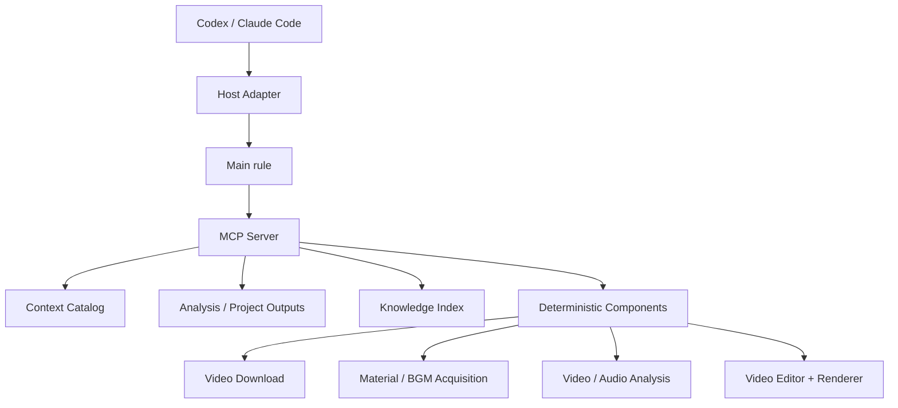

# 剪辑创作插件架构设计

> 状态：已确认
> 设计基线：`cbe62875b933ec455f719bbb5f125c2ac174a179`
> 本文定义 Plugin、MCP Server、rules、skills、视频分析、知识存储、分阶段创作与现有剪辑引擎的最终边界。

## 1. 系统目标

本项目交付一个本地剪辑创作 Plugin，使 Codex、Claude Code 等宿主 Agent 通过同一组阶段规则、思维技能和 MCP 工具完成三类任务：

1. 学习参考视频并沉淀可复用剪辑知识。
2. 从用户想法逐步生成视频并交给现有剪辑引擎执行。
3. 先分析参考视频，再使用新素材创作具有相似剪辑规律和观看体验的视频。

Plugin 由四类内容组成：

```text
Plugin
├── Host manifests          Codex / Claude Code 薄适配
├── rules                   角色职责、阶段边界与禁止项
├── skills                  各阶段的思维步骤与工具使用说明
└── MCP Server
    ├── 工具调用与输出文件
    ├── 确定性视频/音频分析
    ├── 视频下载、素材与 BGM 获取
    ├── 知识存储与检索
    └── 工程校验、渲染与成片检查
```

系统采用以下职责分离：

- Agent 决定任务类型、阶段计划、语义判断和创作内容。
- rules 规定角色拥有哪些决策权以及何时停止。
- skills 规定完成某类判断时应观察哪些证据、按什么步骤思考、调用哪些工具。
- MCP Server 执行可校验操作，只持久化知识、分析证据和长任务 Job，不在内部隐式进行创意决策。
- 现有组件继续拥有下载、素材获取和剪辑执行领域逻辑，MCP 只做薄映射。

## 2. 基线事实与新增范围

### 2.1 指定提交已有能力

| 模块 | 已有公共边界 | 可直接复用内容 |
| :-- | :-- | :-- |
| `components/video_download/` | `download_video(...) -> DownloadResult`、`video-download` CLI | 分享文本取链、抖音 Playwright、yt-dlp、ffprobe 验证、稳定错误码 |
| `components/material_acquisition/` | `sources -> search -> acquire` | 视频素材检索、`candidate_ref`、授权字段门禁、SHA-256、provenance JSON；公共服务当前只开放视频 |
| `components/video_editor/` | `EditorProject 2.0`、`CommandBatch`、`VideoEditorService`、CLI、HTTP | 工程 revision、素材导入、静态多轨合成、持久化渲染队列、FFmpeg 输出验证 |

基线证据：

- `pyproject.toml:5-39`
- `components/video_download/downloader.py:42-151`
- `components/material_acquisition/service.py:145-380`
- `components/video_editor/models.py:12-180`
- `components/video_editor/commands.py:70-173`
- `components/video_editor/render.py:47-314`
- `docs/架构/本地视频剪辑器架构.md:580-618`

### 2.2 指定提交缺少的能力

- Plugin manifests 与 MCP Server。
- 按任务和阶段组织的 rules、skills 与资源目录。
- 视频分析任务、抽帧、候选切点、密集复核和证据清单。
- BGM 多层结构、音画关系和剪辑句子分析。
- 由 Agent 管理的分阶段创作流程和项目文件交接。
- 图片素材获取公共接口，以及 BGM 搜索、下载、授权与溯源公共接口。
- 素材抽帧、转码、裁切、抠像等预处理的统一 provenance 契约。
- 宿主上下文六章参考分析、向量知识索引和阶段过滤检索。
- 可执行剪辑规格到现有 `EditorProject` 的转换校验与可追溯映射。
- 渲染结果对规格的自动检查报告。

### 2.3 当前引擎能力边界

`EditorProject 2.0` 当前支持：

- 素材源区间裁切；
- 静态位置、尺寸、旋转与透明度；
- visual 轨多层覆盖；
- 固定样式文本；
- 静态音量与多路音频混合；
- H.264/AAC MP4 输出。

当前工程模型没有关键帧、缓动、变速、遮罩、转场对象、效果作用域、跨镜头延续、节拍引用和嵌套 Composition。规格转换遇到这些能力时必须返回 `CapabilityGap`，不得忽略字段、替换效果或简化创意。

## 3. 核心架构原则

### 3.1 单向具体化

```text
总体方案：确定做成什么以及采用什么制作方法
素材与 BGM：确定实际使用什么资源
剪辑规格：确定资源怎样形成精确时间线
执行工程：把已确认规格映射为 EditorProject
剪辑引擎：执行工程
成片检查：报告规格与结果之间的偏差
```

下游阶段只继续具体化上游产物。素材不足、能力缺口或渲染问题只形成报告，由用户指定返回阶段。

### 3.2 角色不是进程

角色表示一组稳定职责和输入输出合同，不等于强制启动子 Agent。

- 宿主支持且并行有价值时，主 Agent 可把当前阶段说明与输入文件委派给子 Agent。
- 主 Agent 独立执行时，加载同一角色 rule 和 skills。
- 两种执行方式生成同一种项目文件，接受同一套验证。

### 3.3 创意内容与程序数据分层

| 内容 | 表达方式 |
| :-- | :-- |
| 视频总体方案 | 固定语义板块的自然语言文档 |
| 参考片总体理解 | 宿主上下文六章分析，结论携带证据与置信度 |
| 素材包、来源、授权、BGM 分析 | 严格 JSON |
| 逐镜可执行剪辑规格 | 人类可读表格与严格 ActionSpec 附录；自然语言说明创作意图，稳定 ID 承担程序校验 |
| 执行工程、渲染参数、分析与渲染作业状态 | 严格 Schema |
| 向量知识单元 | 结构化元数据加语义正文 |

严格 Schema 不提前代替创意表达；所有程序边界仍使用稳定模型、版本和错误码。

### 3.4 用户确认由 Agent 管理

Agent 先在对话中展示阶段结果。用户明确确认后，Agent 才把该结果用于下一阶段或发布为共享知识。

MCP Server 不保存用户确认、当前阶段和等待状态，也不推断用户意图。需要被程序读取的结果直接写成带 Schema 的 JSON、Markdown 或工程文件；下游工具通过路径和必要的 SHA-256 校验输入。

## 4. Plugin 包结构

```text
video_create/
├── .codex-plugin/
│   └── plugin.json
├── .claude-plugin/
│   └── plugin.json
├── .mcp.json
├── rules/
│   ├── main-agent.md
│   ├── common/
│   │   ├── evidence-boundary.md
│   │   └── stage-boundary.md
│   ├── reference-study/
│   └── creation/
├── skills/
│   ├── reference-study/
│   ├── reference-visual-analysis/
│   ├── reference-bgm-analysis/
│   ├── audiovisual-relation-analysis/
│   ├── editing-grammar-synthesis/
│   ├── creative-direction/
│   ├── material-preparation/
│   ├── bgm-preparation/
│   ├── editing-specification/
│   ├── execution-project-authoring/
│   └── render-inspection/
├── video_create_plugin/
│   ├── mcp/
│   ├── context/
│   ├── knowledge/
│   ├── jobs/
│   └── application/
├── components/
│   ├── video_download/             现有
│   ├── material_acquisition/       现有
│   ├── video_editor/               现有
│   ├── video_analysis/             新增
│   ├── audio_analysis/             新增
│   ├── bgm_acquisition/            新增
│   ├── image_acquisition/          新增
│   ├── media_preprocessing/        新增
│   └── render_inspection/          新增
└── tests/
```

两个宿主 manifest 只声明名称、触发说明、skills 目录和 MCP 配置。rules、skills、知识与组件只有一份，不为每种宿主复制实现。

项目根目录 `.mcp.json` 启动本地 stdio Server：

```json
{
  "mcpServers": {
    "video-create": {
      "command": "uv",
      "args": ["run", "video-create-mcp"],
      "cwd": "."
    }
  }
}
```

首期运行拓扑为 Windows 本地、单用户、stdio MCP。创作过程保留在宿主 Agent 上下文中；跨会话继续时，Agent 重新读取用户保存的项目文件。

## 5. 运行拓扑与依赖方向



依赖方向固定为：

```text
Host manifests / skills / rules
        ↓
MCP handlers
        ↓
Application services
        ↓
Knowledge / Job repositories + independent components
```

- MCP Handler 只解析参数、调用应用服务、映射结果和错误。
- 应用服务组合既有组件的 Python 公共 API，不通过 shell 回调项目自身 CLI。
- 组件不依赖 MCP、宿主、rules 或 skills。
- `VideoEditorService` 继续保持与 FastAPI、MCP 和 FFmpeg 进程编排解耦。

## 6. rules、skills 与渐进式上下文

### 6.1 三类内容的职责

| 类型 | 内容 | 加载时机 |
| :-- | :-- | :-- |
| main rule | 任务分类、阶段路由、用户确认、修改归属、禁止越权 | Plugin 触发后首先加载 |
| role rule | 当前角色的输入、决策权、禁止项、输出和停止条件 | 进入对应阶段时加载 |
| skill | 证据检查顺序、推理步骤、工具调用和产物模板 | 当前阶段确实需要该能力时加载 |

rule 不包含完整操作教程；skill 不重新定义角色权限；MCP Tool 不携带隐藏角色提示词。
任务类型判断直接属于 main rule，不建立只重复分类条件的 router skill。

### 6.2 MCP 中的呈现方式

MCP 官方协议把 Resources 用于上下文，把 Tools 用于模型主动执行的操作。因此 rules、skills、知识与分析证据通过 MCP Resources 暴露，执行动作通过 MCP Tools 暴露。规范依据见 [MCP Server Primitives](https://modelcontextprotocol.io/specification/2025-06-18/server/index)。

资源 URI：

```text
video-create://catalog
video-create://rules/main-agent
video-create://rules/{role_id}
video-create://skills/{skill_id}
video-create://knowledge/{knowledge_id}
video-create://analysis/{analysis_id}/{evidence_id}
video-create://schemas/{schema_name}
```

Context Catalog 显式注册主 Rule 与 Schema，并从 `rules/roles/*.md` 和
`skills/*/SKILL.md` 受控发现角色 Rule 与 Skill。角色 Rule 的 `role_id`
必须与文件名一致；Skill 的 `name` 必须与目录名一致。任意文件路径不进入加载接口。
角色 Rule frontmatter 必须包含 `role_id`、`version` 与非空 `description`；Skill
frontmatter 必须是合法 YAML mapping，包含 `name`、非空 `description` 与
`metadata.resource_version`；schema 必须是 JSON object。
任一内容缺失、编码错误或结构不合法时，Server
拒绝启动并返回稳定错误；目录中的 `content_sha256` 按分发文件的 UTF-8 字节计算。

资源发现只决定可读取的版本化内容。主 Agent 根据当前工作显式选择 `role_resource`
与 `skill_resources`；角色与 Skill 不因出现在目录中而自动激活。

Resource 内容本身不获得 system-rule 优先级。Host Adapter 负责读取主 Agent 选定的
rule 与 skill Resources，并按宿主支持的上下文层级注入；MCP Server 只分发版本化内容，
不负责激活角色或保存当前阶段。

### 6.3 阶段上下文加载

主 Agent 在进入新阶段时，根据当前对话和已经确认的输入文件组织本次上下文：

```json
{
  "task_type": "reference_guided_creation",
  "stage": "editing_specification",
  "role_resource": "video-create://rules/creation/editing-spec-agent",
  "skill_resources": [
    "video-create://skills/editing-specification"
  ],
  "input_files": [
    {"kind": "creative_direction", "path": "project/creative-direction.md"},
    {"kind": "materials", "path": "project/material-package.json"},
    {"kind": "bgm", "path": "project/bgm-package.json"}
  ],
  "retrieval_scope": {
    "stage": "stage3",
    "task_private_analysis_ids": ["analysis_xxx"]
  },
  "output_contract": "video-create://schemas/editing-specification"
}
```

该对象只存在于 Agent 当前调用上下文，不写入 Plugin 数据库。所有 MCP Tools 保持固定可发现；
渐进式加载只控制 Agent 本次读取哪些 rules、skills、输入文件和知识范围。

## 7. Agent 角色结构

| 角色 | 决策权 | 输出 |
| :-- | :-- | :-- |
| 主 Agent | 任务类型、阶段计划、是否委派、确认点、修改路由 | 当前对话与阶段输入 |
| 参考源处理角色 | 选择分析参数与证据细化区间 | SourceMedia、Analysis Job、EvidenceBundle |
| 画面分析角色 | 主镜头、可见图层、运动、效果作用域、镜头组 | VisualAnalysis |
| BGM 分析角色 | 音乐段落、节奏层、声音事件、能量结构 | BgmAnalysis |
| 音画关系角色 | 同步、提前蓄力、拍后释放、延音维持和非节拍关系 | AudiovisualMap |
| 剪辑规律角色 | 连续镜头组成的剪辑句子与可迁移机制 | ReusableEditingGrammar |
| 总体方案角色 | 视频类型、核心机制、制作方法与观看体验 | CreativeDirection 文档 |
| 素材角色 | 资源发现、筛选、预处理与溯源 | MaterialPackage |
| BGM 筹备角色 | BGM 选择与音乐分析 | BgmPackage |
| 镜头规划角色 | 已确认资源范围内的具体时间线设计 | EditingSpecification |
| 执行工程角色 | 发起能力预检和确定性编译，不新增创意 | CapabilityAssessment 或 EditorProject + SpecTraceMap |
| 成片检查角色 | 解释确定性检查结果并向用户报告 | RenderInspectionReport |

任何角色都不得擅自改写用户已经确认的上游结果。

## 8. 三类任务流程

### 8.1 学习参考视频 `reference_study`


多维分析包含：

- 视频总体机制；
- 主镜头边界与镜内状态变化；
- 图层、PIP、遮罩、动画和效果作用域；
- BGM 段落、节奏层、能量和声音事件；
- 画面变化与音乐事件的时序关系；
- 连续镜头组成的剪辑句子；
- 观看体验和可迁移剪辑规律。

用户只确认第六章中的待沉淀知识。各分析维度是同一阶段内的工作单元，可按需串行或并行。

### 8.2 原创视频 `original_creation`

```text
用户想法
→ 视频总体方案
→ 用户确认
→ 素材与 BGM 筹备
→ 用户确认
→ 逐镜可执行剪辑规格 + ActionSpec
→ 用户确认
→ Capability Preflight
→ 能力齐备后确定性编译 EditorProject + SpecTraceMap
→ 工程与覆盖校验
→ 剪辑引擎执行
→ 成片检查
```

`original_creation` 虽然没有绑定本次参考视频分析，但创作阶段一至三均可检索 active 共享知识：

| 阶段 | 强制检索范围 | 用途 |
| :-- | :-- | :-- |
| 阶段一：总体方案 | `status=active` + `stage=stage1` + 对应 `knowledge_type` | 借鉴视频类型、核心机制、视觉语言、节奏方法和观看体验 |
| 阶段二：素材与 BGM | `status=active` + `stage=stage2` + 对应 `knowledge_type` | 借鉴素材特征、动作方向、预处理方式、BGM 气质与能量结构 |
| 阶段三：剪辑规格 | `status=active` + `stage=stage3` + 对应 `knowledge_type` | 借鉴剪辑句子、图层模式、音画关系、镜头密度与转场规律 |

每个阶段先读取 Agent 当前上下文中用户已经确认的上游结果，再按 active 状态、阶段、
视频类型和知识类型检索共享知识。能力预检、
工程编译、渲染和成片检查只读取确认后的项目文件、Schema 与 Capability Registry，
避免执行阶段引入新的创意判断。

### 8.3 参考驱动创作 `reference_guided_creation`

```text
ReferenceStudyFlow
→ 确认后的本次参考分析
→ OriginalCreationFlow
```

创作阶段的上下文顺序固定为：

1. 直接读取当前宿主上下文中用户确认的六章参考分析。
2. 读取其中面向当前阶段的待沉淀知识和可迁移结论。
3. 检索共享知识索引中的其他已确认案例。

本次参考分析不绕行共享向量召回，避免被历史相似案例稀释。

## 9. 视频分析组件

### 9.1 组件边界

`components/video_analysis/` 负责生成可复现证据，不负责最终语义判断：

- 计算源文件 SHA-256；
- 调用 ffprobe 获取音视频流和真实 time base；
- 建立 PTS 与 frame index；
- 生成代理文件、缩略图、联系表和指定时间帧；
- 计算相邻帧差、亮度、色彩变化、黑场、闪白和运动信号；
- 生成候选主镜头边界；
- 对指定区间按原始帧率或目标最大采样间隔重新取证；
- 输出确定性结果文件、证据文件引用与算法版本。

`components/audio_analysis/` 负责：

- 抽取 PCM 音轨与波形；
- 响度、静音、频谱、瞬态和 tempo 候选；
- beat grid、重拍候选、节奏密度和能量曲线；
- 音乐段落边界候选；
- 供 Agent 复核的音频片段和可视化证据。

鼓、贝斯、旋律、人声、SFX 的语义归属由 BGM 分析角色结合证据判断；算法输出须标明候选类型与置信度。

### 9.2 自适应多遍分析

```text
Pass 1  技术探测与低频全片扫描
Pass 2  视觉/音频变化候选检测
Pass 3  快切、复杂叠层和关键边界密集取证
Pass 4  Agent 逐镜与镜头组复核
Pass 5  时间线、证据引用和六章分析一致性检查
```

- 抽帧参数使用 `max_sample_interval` 表达，不把可变帧率视频映射成虚构固定帧号。
- 快切区间的最大取样间隔不大于 0.1 秒。
- 候选边界使用前后帧或原始帧率复核，最终时间使用真实 PTS。
- 画中画出现、字幕替换、局部特效和速度变化默认是镜内事件；主画面真实更换才建立新镜头。
- 自动差异峰值只是复核候选，不直接成为主镜头边界。

所有时序证据使用统一 `TimestampRef`：保留原始 `pts`、`time_base`、可用时的 `frame_index`、整数 `timestamp_us`，音频事件另保留 `sample_index` 与采样率。宿主分析显示秒值，但程序关联和边界校验使用整数时间与原始时基。

### 9.3 EvidenceBundle

```text
output/plugin/analysis/{analysis_id}/
├── video/
│   ├── video_analysis.json
│   ├── frame_index.jsonl
│   ├── visual_signals.json
│   ├── boundary_candidates.json
│   ├── frames/
│   └── contact_sheet.jpg
├── audio/
│   ├── audio_analysis.json
│   ├── audio_mono_s16le.pcm
│   ├── audio_signals.json
│   ├── waveform.json
│   └── waveform.svg
└── refinements/
    └── {refinement_hash}/
```

EvidenceBundle 根据已完成的 Analysis Job、结果文件和嵌套证据确定性构造，不另存 Manifest。构造时逐文件核对受控路径与 SHA-256；Agent 分析中的重要结论引用对应 `evidence_id`。

### 9.4 结论证据等级

```text
measured                 工具直接测量
algorithm_candidate      算法提出、尚待语义复核
agent_inference          Agent 基于证据作出的解释
reconstruction_suggestion 缺少原工程时给出的重建方法
```

原始素材入点、原工程图层、关键帧曲线、独立 SFX 轨和具体插件参数不得标记为 `measured`。

## 10. 参考视频分析产物

### 10.1 宿主上下文六章分析

宿主 Agent 读取真实 Evidence Resource 后，在当前上下文形成一份连续的六章分析：

1. 参考视频总体概括；
2. BGM 结构分析；
3. 参考片逐镜效果分析；
4. 音画关系与剪辑语法；
5. 整体总结与重新创作原则；
6. 待沉淀知识。

逐镜分析按 `RhythmUnit → MainShot → InShotEvent` 组织，解释参考片中真实发生的变化，不承担新素材的逐镜执行设计。重要事实和推断标明证据引用、事实状态与置信度；tempo、beat、候选边界等算法结果保留候选身份。

第六章按“阶段 → 视频类型标签 → 知识类型”列出带稳定编号的候选知识。用户确认全部条目或排除指定编号后，Agent 只调用一次 `knowledge_publish`；确认前不发布共享知识。

### 10.2 报告与持久化边界

六章正文属于宿主上下文。用户要求保存时，由宿主文档能力导出并展示 DOCX；Plugin 不生成或持久化报告文件、阶段投影、报告 Manifest 和报告正文。

Plugin 只持久化来源媒体、Analysis Job、确定性证据和用户确认后的原子知识。机器可读事实由 Analysis Job 与 Evidence Resource 提供，语义分析过程不复制到 Plugin 数据根。

## 11. 创作阶段产物

### 11.1 阶段一：CreativeDirection

使用自然语言输出：

- 视频类型与核心机制；
- 整体制作方法；
- 视觉语言与画面组织；
- 节奏与声音方法；
- 转场与镜头连接原则；
- 素材与音乐性质；
- 预期观看体验。

本阶段排除具体素材、秒点、镜头数量、源入出点、坐标、关键帧和引擎参数。

### 11.2 阶段二：MaterialPackage 与 BgmPackage

`MaterialPackage` 包含已选素材、内容摘要、技术参数、可用区间、预处理结果、来源和授权证据。完整形态的素材入口包括用户提供文件、现有视频素材服务、新增图片素材服务，以及从已取得媒体生成的帧和预处理派生物；每类产物沿用 SHA-256 与 provenance 契约。现有 `materials_search` 只代表视频素材搜索。

`BgmPackage` 包含最终音乐文件、来源和授权、段落、节拍、能量、编辑提示及音频分析数据。

素材角色和 BGM 角色可并行，均不设计最终时间线。两者完成后生成
`PreparationPackageManifest`，列出 MaterialPackage、BgmPackage 和全部 provenance
文件的相对路径与 SHA-256。

### 11.3 阶段三：EditingSpecification

阶段三同时提交人类可读表格与权威机器附录 `editing_specification.json`。

| 镜头 | 绝对时间 | 使用素材 | 镜头规划编排 | 附加效果 | 声音与节拍 | 与下一镜头的转场 |
| :-- | :-- | :-- | :-- | :-- | :-- | :-- |

“镜头规划编排”必须说明每个素材的使用区间、位置、尺寸、层级、遮挡、进入/保持/退出、动画、效果、叠加关系和最终共同形成的画面。表格中的每项执行动作都引用稳定 `action_id`。

```text
shot_id
action_id
action_type
time_range = start_us + end_us
asset_refs[]
parameters
effect_scope
required_capabilities[]
human_description
audio_event_refs[]
transition_target_shot_id
```

严格 ActionSpec 负责动作枚举、参数与程序覆盖校验；自然语言保留创作意图和组合关系。
表格与机器附录保存在同一项目目录，校验器检查 shot/action 双向引用完整性。

### 11.4 能力预检、确定性编译与可追溯映射

阶段四按固定顺序执行：

```text
EditingSpecification
→ Schema、素材引用与时间线校验
→ Capability Preflight
→ 存在缺口：输出 CapabilityGapReport 并停止
→ 能力齐备：确定性编译 EditorProject + SpecTraceMap
→ 工程领域校验
→ 提交渲染
```

`CapabilityAssessment` 逐项匹配 ActionSpec 的 `required_capabilities` 与引擎 Capability Registry。缺口动作只进入 `CapabilityGapReport`，不伪造工程 JSON 路径。

阶段四不解析自由文本，也不新增剪法。`editor_compile_spec` 只消费稳定 shot/action ID，并输出：

- `EditorProject`：符合现有剪辑引擎 Schema 的工程文件。
- `SpecTraceMap`：每个已支持 `action_id` 对应的工程 JSON 路径。
- `CapabilityAssessment`：本次预检结果及 Registry 版本。

确定性校验必须满足：

- 所有素材引用存在且哈希一致；
- 主镜头时间线完整，镜内动作时间和作用域合法；
- 所有 ActionSpec 都完成预检；
- 能力齐备时，每个 `action_id` 都有 TraceMap；
- 工程通过 Pydantic 与领域校验；
- 编译输入哈希、引擎 Schema 版本和 Capability Registry 版本写入产物。

## 12. 保存边界

### 12.1 Agent 上下文

任务类型、当前阶段、候选方案、用户确认和下一步计划保留在宿主 Agent 当前上下文中，
不写入 Plugin 数据库。

### 12.2 项目文件

只有后续工具需要读取或用户明确要求保留的结果才写入项目目录：

```text
creative_direction.md
material_package.json
bgm_package.json
preparation_package_manifest.json
editing_specification.md
editing_specification.json
editor_project.json
spec_trace_map.json
render_inspection.json
output.mp4
```

每类文件使用自己的 Schema。清单文件只记录相对路径、SHA-256 和必要的来源关系，
不再为普通文件建立统一状态对象。上游结果修改后，由 Agent 决定重新执行哪些步骤；
下游工具在执行时重新校验输入文件、素材引用和哈希。

### 12.3 Plugin 持久化

Plugin 只持久化：

- 用户确认发布的可复用知识；
- 来源媒体、参考分析的确定性结果与必要证据；
- 视频分析和渲染等长任务的最小 Job 状态。

完整 prompt、用户聊天、临时推理和阶段等待状态不持久化。

## 13. 知识存储与检索

### 13.1 LanceDB 单库与文件目录

```text
LanceDB 单库
  knowledge_units
    用户确认发布的知识事实、结构化元数据和正文向量

文件目录
  来源媒体、帧、联系表、波形、算法结果和项目输出
```

LanceDB 是已发布知识事实与向量的唯一数据库。知识正文、阶段、视频类型、知识类型、证据引用、来源分析、状态和向量保存在同一行；文件目录保存确定性证据与项目输出。LanceDB 的本地嵌入式连接和单表数据结构见 [LanceDB Quickstart](https://docs.lancedb.com/quickstart)。

### 13.2 知识分类

| 目标阶段 | knowledge_type |
| :-- | :-- |
| 阶段一 | `core_mechanism`、`production_method`、`visual_language`、`rhythm_method`、`transition_principle`、`asset_music_traits`、`viewing_experience` |
| 阶段二 | `asset_selection_traits`、`shot_composition_traits`、`action_direction_traits`、`preprocess_need`、`bgm_mood`、`music_sections`、`energy_curve`、`rhythm_events` |
| 阶段三 | `editing_sentence`、`shot_switch_logic`、`layer_composition_pattern`、`motion_pattern`、`effect_scope`、`audio_visual_binding`、`cross_shot_continuity`、`density_pattern`、`transition_pattern` |

### 13.3 KnowledgeUnit

```text
knowledge_id
stage
knowledge_type
video_types[]
content
evidence_refs[]
provenances[]
confidence
status = active | archived
embedding_model
embedding_version
embedding_sha256
embedding_dimension
vector
created_at / updated_at
```

一条知识只有一个阶段、一个知识类型、一个正文和一个向量，可携带多个动态视频类型和多个证据引用。发布与搜索共用固定的本地中文 Embedding 模型；模型或维度变化时从正文重建整张表的向量，单个表只使用一个向量空间。

### 13.4 发布与显式合并

`knowledge_publish` 只接收 `analysis_id` 与用户最终选中的知识条目。插件在写入前完成：

- 分析任务、证据 URI、证据归属和时间范围校验；
- 展示编号、阶段、视频类型、知识类型、正文和置信度校验；
- 新知识的 `knowledge_id` 与正文向量生成；
- `existing_knowledge_id` 的 active 状态、阶段和知识类型一致性校验；
- 整批最终行的 `knowledge_id` 唯一性校验。

同一数据根只允许一个知识写入者。知识存储写锁覆盖读取待合并行、整批验证、最终行构造和一次 LanceDB `merge_insert` 提交。显式合并只追加去重后的视频类型、证据和来源分析，保留已有正文与向量。语义相似度只辅助 Agent 判断是否提交 `existing_knowledge_id`，插件不自动合并。

### 13.5 检索顺序

```text
status=active 与 stage 精确预过滤
→ video_types 任意一个匹配
→ knowledge_types 匹配
→ 正文向量相似度排序
→ 返回知识正文、分类、证据、置信度和 similarity
```

`video_types` 使用列表字段和 `LABEL_LIST` 索引，多个请求类型通过 `array_has_any` 表达并集语义。阶段、知识类型和状态使用标量索引。结构化条件在向量排序前执行；向量结果不替代绝对时间、beat grid、文件哈希或完整证据读取。LanceDB 的预过滤和列表索引见 [Metadata Filtering](https://docs.lancedb.com/search/filtering)。

## 14. MCP Resources 与 Tools

### 14.1 Resources

| Resource | 用途 |
| :-- | :-- |
| `catalog` | 注册角色、skills、Schema、工具权限和版本 |
| `rules/*` | 角色职责与阶段边界 |
| `skills/*` | 当前阶段思维流程 |
| `knowledge/*` | 读取已发布的可复用知识 |
| `analysis/*` | 读取帧、波形、联系表和结构化证据 |
| `schemas/*` | 查看输出合同 |

### 14.2 Reference Analysis Tools

| Tool | 作用 |
| :-- | :-- |
| `reference_resolve_source` | 接收本地文件、URL 或分享文本，复用视频下载组件 |
| `media_probe` | 返回媒体流、真实 time base、时长与哈希 |
| `analysis_start` | 创建多遍视频/音频证据任务 |
| `analysis_get_job` | 查询任务状态、进度和错误 |
| `analysis_refine_intervals` | 对指定区间按原始帧率或最大间隔密集取证 |

帧、联系表、波形和分析 JSON 通过 Resource 读取，避免大二进制内容直接塞入工具结果。

### 14.3 Knowledge Tools

| Tool | 作用 |
| :-- | :-- |
| `knowledge_list_stage_types` | 按 active 状态与输入阶段过滤后，实时汇总视频类型和知识类型 |
| `knowledge_publish` | 以一次串行化原子事务保存或显式合并用户确认的知识 |
| `knowledge_search` | 预过滤 active 状态、阶段、视频类型和知识类型，再执行向量排序 |

### 14.4 Resource Acquisition Tools

| Tool | 复用或新增边界 |
| :-- | :-- |
| `video_download` | 映射现有 `download_video` |
| `materials_list_sources` | 映射现有 `sources` |
| `materials_search` | 映射现有 `search` |
| `materials_acquire` | 映射现有视频素材 `acquire` |
| `images_list_sources` | 新图片来源目录 |
| `images_search` | 新图片候选与授权字段搜索 |
| `images_acquire` | 新图片下载、哈希、媒体验证和 provenance |
| `media_preprocess` | 对已取得媒体执行声明式预处理并生成派生 provenance |
| `bgm_list_sources` | 新 BGM 来源目录 |
| `bgm_search` | 新 BGM 候选与授权字段搜索 |
| `bgm_acquire` | 新 BGM 下载、哈希、媒体验证和 provenance |

现有 `materials_*` 工具只覆盖视频。图片获取、媒体预处理、BGM 获取和 BGM 音频分析分别属于独立组件，共享 provenance 契约。

### 14.5 Editing and Render Tools

| Tool | 作用 |
| :-- | :-- |
| `editor_create_project` | 映射现有工程创建 |
| `editor_import_asset` | 统一 CLI/HTTP 当前重复的素材导入编排 |
| `editor_apply_commands` | 原样使用 `CommandBatch` 与 revision |
| `editor_preflight_spec` | 校验 ActionSpec 并对照 Capability Registry；缺口时生成报告 |
| `editor_compile_spec` | 能力齐备后确定性编译 EditorProject 与 SpecTraceMap |
| `editor_validate_execution_project` | 校验 EditorProject、SpecTraceMap 与全部 ActionSpec 覆盖 |
| `editor_submit_render` | 提交不可变工程快照 |
| `editor_get_render` | 查询持久化渲染任务 |
| `editor_inspect_render` | 检测黑帧、越界、音画长度、响度和规格覆盖 |

## 15. 组件与 MCP 的错误契约

统一响应：

```jsonl
{"ok": true, "data": {}}
{"ok": false, "error": {"code": "...", "message": "...", "details": {}}}
```

`common.schema.json` 的根合同接受 `FileRef`、`TimeRangeUs`、`SuccessResponse`
或 `ErrorResponse` 之一；成功与错误响应保持互斥，不使用同时聚合两者的容器对象。

新增稳定错误码：

```text
task_type_invalid
file_not_found
file_hash_mismatch
evidence_not_found
analysis_failed
analysis_incomplete
knowledge_filter_required
knowledge_publication_rejected
action_spec_invalid
capability_gap
spec_trace_incomplete
render_inspection_failed
context_content_invalid
context_content_not_found
```

既有组件错误码保留原值，通过 `details.component` 标记来源，不在 MCP 层改写语义。

## 16. 数据目录

```text
~/.video-create/
├── output/
│   └── plugin/
│       ├── sources/
│       ├── jobs/
│       │   └── {job_id}.json
│       └── analysis/
│           └── {analysis_id}/
└── knowledge.lancedb/
```

- 分析输出先写临时文件，再原子替换。
- 用户项目文件写入用户指定目录，不复制进 Plugin 数据库。
- 大媒体文件按路径和哈希引用，不写入 LanceDB。
- Plugin 不存储完整 prompt、凭证、聊天记录或创作阶段。
- 日志只保留固定长度的外部工具错误摘要。
- 字幕、OCR 和媒体元数据一律作为不可信证据处理，不作为 Agent 指令。

## 17. 作业、并发与恢复

- 视频分析和渲染使用持久化 Job 状态。
- MCP Server 重启后继续 queued 任务；中断的 running 任务记录 `job_interrupted`。
- 分析中间证据采用内容哈希，可重用已完成步骤。

## 18. 设计红线

- MCP Server 不调用隐藏模型替 Agent 完成阶段思考。
- 不在 Plugin 中保存任务类型、当前阶段、用户确认和临时计划。
- 不为普通项目文件建立通用 Artifact、冻结和失效传播模型。
- 不把所有 rules、skills 和历史知识一次性注入上下文。
- 不把向量索引当作精确事实或版本权威来源。
- 不把参考片逐镜分析表当作新视频的执行规格。
- 不把主 Agent 是否启动子 Agent 固化为工作流要求。
- 不让 IR 转换或引擎重新做创意决策。
- 不因引擎能力不足静默简化 EditingSpecification。
- 不自动反向修改用户已经确认的上游结果。
- 不发布未经用户确认的知识。
- 不复制现有下载、素材获取和剪辑领域逻辑到 MCP Handler。

## 19. 本设计覆盖关系

本设计获批后：

- 项目整体形态由通用组件集合扩展为通用视频创作 Plugin。
- `docs/产品/本地视频剪辑器PRD.md` 中“排除每种 Agent 专属插件”的约束继续适用于编辑器组件本身；Plugin 只提供共享核心和薄宿主适配。
- `docs/产品/本地视频剪辑器PRD.md` 中 MCP 后置项由本设计接管。
- `docs/架构/本地视频剪辑器架构.md` 中 MCP 薄映射、`CommandBatch`、revision 和稳定错误码继续有效。
- 本设计已吸收外部 `剪辑流程编排.md` 的阶段职责、单向具体化与确认边界；该绝对路径只作为设计来源证据，Plugin 分发和运行仅依赖仓库内文档、rules 与 Schema。
